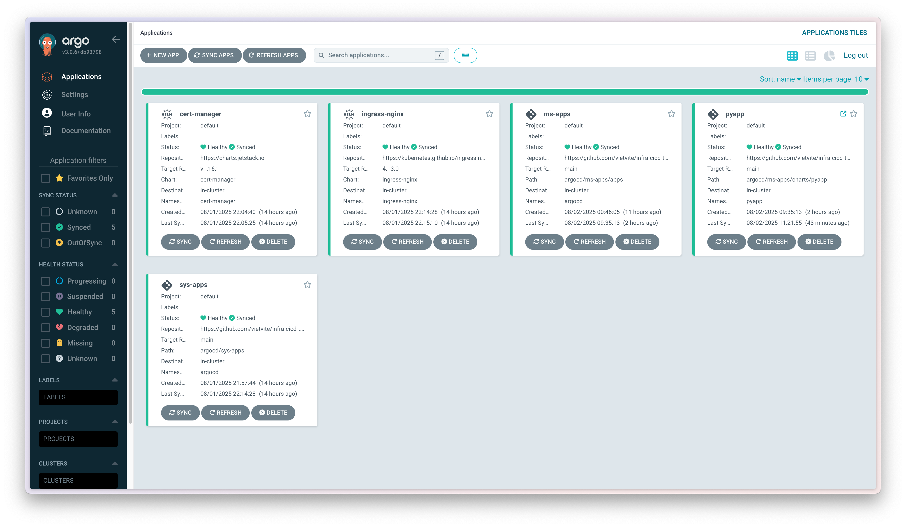
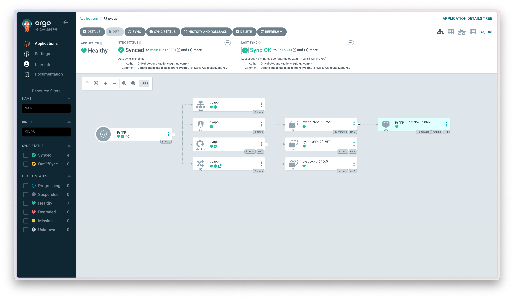
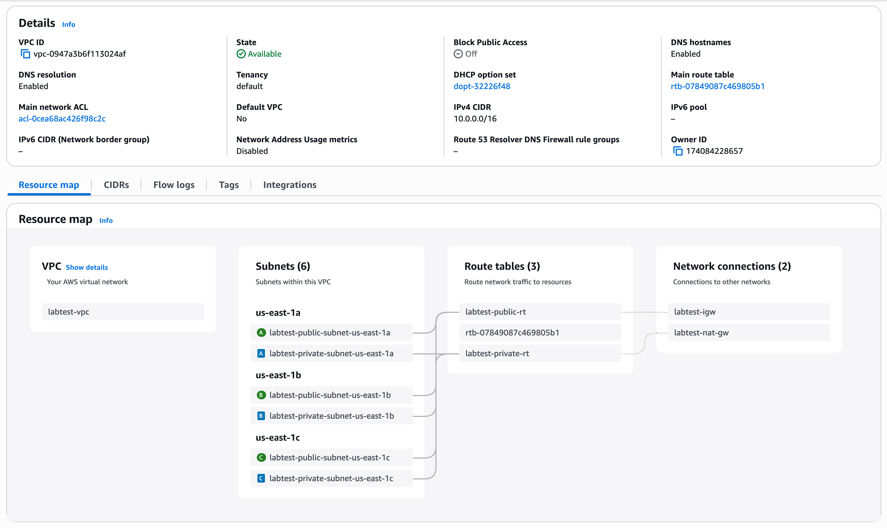
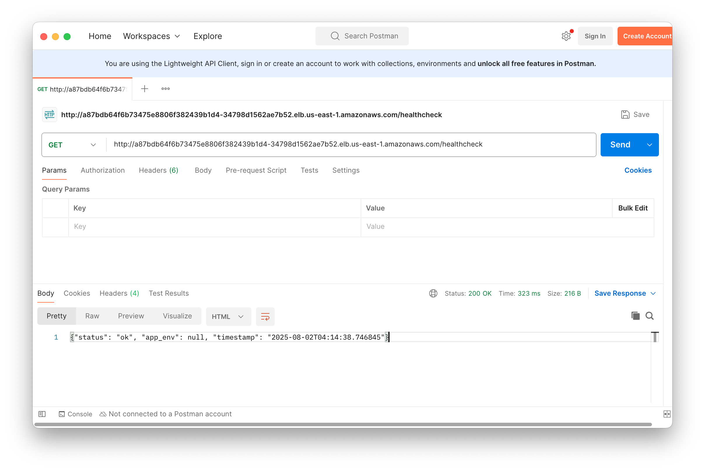

# Infrastructure and CI/CD Implementation

This repository contains the Infrastructure as Code (IaC) and GitOps configurations for deploying and managing applications on AWS EKS.

## Architecture Overview

The implementation follows a GitOps approach using:
- Terraform for infrastructure provisioning
- ArgoCD for continuous deployment
- GitHub Actions for CI pipeline
- Amazon ECR for container registry
- AWS EKS for container orchestration

## Repository Structure

```
├── argocd/                 # ArgoCD configurations
│   ├── ms-apps/           # Microservices applications
│   └── sys-apps/          # System applications (ingress, cert-manager)
├── infrastructure/         # Terraform IaC
│   ├── environments/      # Environment-specific configurations
│   └── modules/           # Reusable Terraform modules
```

## Prerequisites

- AWS Account with appropriate permissions
- kubectl configured for EKS cluster
- ArgoCD installed on the cluster
- GitHub repository secrets configured:
  - AWS credentials (temporary: move to OIDC)
  - GitHub tokens for ArgoCD repo access

## Infrastructure Components

### Core Infrastructure (AWS)
- VPC and networking setup
- EKS cluster
- Application Load Balancer (ALB)
- IAM roles and policies

### Kubernetes Components
- cert-manager for SSL certificate automation
- ingress-nginx for load balancing
- ArgoCD for GitOps deployment

## CI/CD Pipeline

### CI Pipeline (GitHub Actions)
1. Test Stage:
   - Sets up Python environment
   - Installs dependencies via Poetry
   - Runs pytest suite

2. Build Stage:
   - Builds Docker image
   - Tags with commit SHA and latest
   - Pushes to Amazon ECR

3. Deploy Stage:
   - Updates ArgoCD values.yaml with new image tag
   - Commits and pushes changes to trigger ArgoCD sync

### CD Pipeline (ArgoCD)
- Monitors Git repository for changes
- Automatically syncs application state
- Manages rollouts and rollbacks
- Ensures GitOps compliance

## Deployment Process

1. Push code to main branch
2. GitHub Actions triggers CI pipeline
3. On successful build and test:
   - New image is pushed to ECR
   - ArgoCD values are updated
4. ArgoCD detects changes and syncs:
   - Updates Kubernetes deployments
   - Manages rolling updates
   - Configures ingress and SSL

## Configuration

### Infrastructure Configuration
- Environment-specific variables in `infrastructure/environments/<env>/`
- Reusable modules in `infrastructure/modules/`

### Application Configuration
- Base Helm values in `argocd/ms-apps/charts/pyapp/values.yaml`
- Environment overrides in `argocd/ms-apps/environments/<env>/pyapp/values.yaml`

# Further Improvements:

1. Security:
   - Implement GitHub OIDC with AWS IAM role (remove static credentials)
   - Configure ClusterIssuer for automated TLS management
   - CI pipeline:
      - Container scanning
      - Dependency vulnerability scanning
      - SAST/DAST integration
      - Secret scanning
2. Network Automation:
   - Use External DNS for automated domain registration to domain registrar (e.g Route53 zones)
3. Infrastructure Architechture:
   - Since this is a demo, I use one NAT Gateway for saving costs. In production, it should have NAT Gateway for each AZs to avoid single point of failure.
4. Folder Structure:
   - I combined all components of infrastructure and GitOps into this single repository for demonstration purpose. For the production environment, we should:
      - Separate terraform module into separate Github repositories and call them in a central repository using terragrunt, this help modules can deploy independently and avoid code duplication.
      - Separate shared helm chart for application and ArgoCD manifest files into two repositories for maintenance.

# Images
The ArgoCD dashboard


The ArgoCD python app detail


The VPC design


The Postman request to python application


# References
- [Demo python application](https://github.com/vietvite/pyapp)
- [CI pipeline](https://github.com/vietvite/pyapp/blob/main/.github/workflows/ci.yml)
